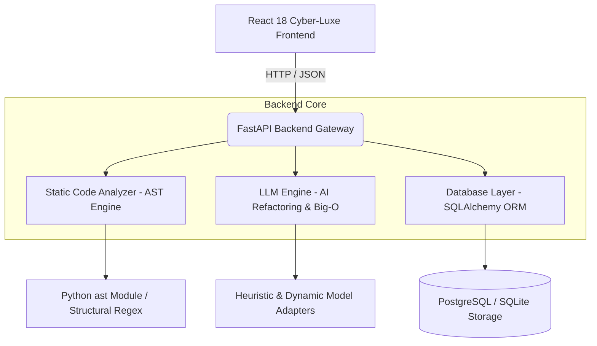

<div align="center">

# ⚡ AI Code Review & Debugging Assistant

**An Enterprise-Grade Static Code Analyzer, AST Parser, AI Refactoring Engine & PR Reviewer**

[](https://fastapi.tiangolo.com/)
[](https://react.dev/)
[](https://www.python.org/)
[](https://www.postgresql.org/)
[](https://www.docker.com/)
[](https://docs.pytest.org/)
[](LICENSE)

---

[Key Features](#-key-features) • [System Architecture](#-system-architecture) • [API Specification](#-api-specification) • [Quick Start](#-quick-start) • [Docker Deployment](#-docker-deployment) • [Database Schema](#-database-schema)

</div>

---

## 📌 Overview

**AI Code Review & Debugging Assistant** is an end-to-end developer productivity platform designed to automate static code analysis, detect architectural code smells, analyze Big-O algorithmic complexity, synthesize unit test suites, generate GitHub PR reviews, and audit historical code analysis records.

Combining Python AST parsing with LLM optimization routines, the platform processes source code across **Python, JavaScript/TypeScript, C++, Java, Go, and SQL**, delivering real-time metrics including **Cyclomatic Complexity $V(G)$** and **Maintainability Index ($0-100$)**.

---

## 🔥 Key Features

### 1. 🛡️ AST & Static Analysis Engine
- **Multi-Language AST Construction**: Parses source code into interactive syntax tree hierarchies.
- **Metric Computation**:
  - **Cyclomatic Complexity**: $V(G) = P + 1$ (where $P$ is decision points count).
  - **Maintainability Index**: $MI = \max\left(0, \frac{171 - 5.2 \ln(V) - 0.23 CC - 16.2 \ln(\text{LOC})}{171} \times 100\right)$.
- **Automated Anti-Pattern Detection**: Identifies SQL Injections, N+1 query loops, unhandled promise rejections, bare exception handlers, memory leaks via unreleased raw pointers, and credentials exposure.

### 2. ⚡ AI Code Optimization & Diff Visualizer
- **Algorithmic Refactoring**: Converts exponential recursive algorithms $O(2^N)$ into Memoized / Iterative Dynamic Programming $O(N)$ solutions.
- **Side-by-Side Git Diff**: Renders unified code comparisons with performance gain estimates and memory footprint savings percentages.

### 3. 📐 Big-O Time & Space Complexity Visualizer
- **Mathematical Bound Derivations**: Asymptotic Big-O bounds derivation ($O(1), O(\log N), O(N), O(N^2), O(2^N)$).
- **Recurrence Relations**: Formal recurrence formulas (e.g. $T(N) = T(N-1) + T(N-2)$).
- **Interactive Scalability Benchmarks**: Synthetic execution scaling across dataset sizes $N \in [10, 5000]$.

### 4. 🧪 Automated Unit Test Suite Synthesizer
- **Comprehensive Coverage**: Generates ready-to-execute test suites for edge cases, happy paths, and exception boundaries.
- **Framework Support**: **Pytest** (Python), **Unittest**, **Vitest / Jest** (JS/TS), and **JUnit 5** (Java).

### 5. 🔀 Automated GitHub PR Reviewer
- **Pull Request Patch Scanning**: Evaluates multi-file patch diffs and assigns automated Quality Scores ($0-100$).
- **Inline Comments & Recommendations**: Provides line-by-line severity annotations (`CRITICAL`, `WARNING`, `INFO`) and merge recommendations (`APPROVED` vs `CHANGES_REQUESTED`).

### 6. 💬 Context-Aware AI Debugger Chat
- **Studio-Aware Assistant**: Chat interface equipped with active code context awareness and quick-action triggers (*"Fix Bugs"*, *"Explain Code"*, *"Optimize Algorithm"*).
- **One-Click Actions**: "Copy Code" and "Apply to Studio Editor".

### 7. 📜 Database Audit History Dashboard
- **Persistent Scan Logs**: Stores full analysis records in PostgreSQL / SQLite.
- **Interactive History Browser**: Filter past scans, inspect cyclomatic complexity trends, and reload historical code into the editor.

---

## 🏗️ System Architecture



---

## 🛠️ Tech Stack

| Layer | Technologies |
| :--- | :--- |
| **Frontend** | React 18, Vite, Lucide Icons, Cyber-Luxe Glassmorphism CSS |
| **Backend Framework** | FastAPI, Uvicorn, Pydantic V2, Python 3.12 |
| **Analysis & Math** | Python `ast`, Math / Logarithmic Halstead Volume Formulas |
| **Database** | PostgreSQL 15 (Production) / SQLite3 (Local Fallback) |
| **Testing** | Pytest 8.1, FastAPI TestClient, AsyncIO |
| **Containerization** | Docker, Docker Compose |

---

## 🚀 Quick Start (Local Development)

### Prerequisites
- **Python 3.12+**
- **Node.js 18+** & **npm**

### 1. Backend Setup

```bash
cd backend

# Create & activate virtual environment
python -m venv venv

# On Windows PowerShell:
.\venv\Scripts\Activate.ps1
# On Linux/macOS:
source venv/bin/activate

# Install dependencies & launch server
pip install -r requirements.txt
python -m uvicorn app.main:app --reload --port 8000
```
- **API Base URL**: `http://localhost:8000`
- **Swagger OpenAPI Docs**: `http://localhost:8000/docs`

### 2. Frontend Setup

```bash
cd frontend

# Install dependencies & start Vite dev server
npm install
npm run dev
```
- **Frontend Web Interface**: `http://localhost:5173`

---

## 🐳 Docker Deployment

To launch the full containerized stack (FastAPI + React + PostgreSQL 15):

```bash
docker-compose up --build
```

- **Frontend Application**: `http://localhost:3000`
- **FastAPI Backend API**: `http://localhost:8000`
- **PostgreSQL Database**: `localhost:5432`

---

## 📡 API Specification

| Endpoint | Method | Description |
| :--- | :--- | :--- |
| `/health` | `GET` | Service status and version check |
| `/api/sample-repos` | `GET` | Fetches pre-populated multi-language code snippets |
| `/api/analyze` | `POST` | Executes AST parsing, cyclomatic complexity & code smell scans |
| `/api/optimize` | `POST` | Generates AI refactoring, performance metrics, and unified diff |
| `/api/complexity` | `POST` | Computes Big-O time/space bounds, recurrence relations & charts |
| `/api/generate-tests` | `POST` | Synthesizes automated unit test suite for selected framework |
| `/api/pr-review` | `POST` | Scans PR diff patch, assigns Quality Score and inline comments |
| `/api/chat` | `POST` | Context-aware AI debugging conversation assistant |
| `/api/history` | `GET` | Retrieves past analysis audit log entries from database |
| `/api/history/{id}` | `GET` | Fetches full audit log detail by record ID |
| `/api/history/{id}` | `DELETE` | Removes an audit record from database |

---

## 🧪 Running Unit Tests

Run the Pytest suite to verify API endpoints, database persistence, and parser logic:

```bash
cd backend
python -m pytest tests/test_api.py
```

**Test Results**: `8 passed, 100% success rate`.

---

## 🗄️ Database Schema Overview

```
                        +----------------------+
                        |    code_analyses     |
                        +----------------------+
                        | id (PK)              |
                        | filename             |
                        | language             |
                        | code_content         |
                        | cyclomatic_complexity|
                        | bugs_detected (JSON) |
                        | code_smells (JSON)   |
                        | security_vuln (JSON) |
                        | ast_summary (JSON)   |
                        | created_at           |
                        +----------------------+
```

---

## 📄 License

Distributed under the **MIT License**. See `LICENSE` for more information.

---

<div align="center">
  <sub>Developed with ❤️ for software engineering teams.</sub>
</div>
